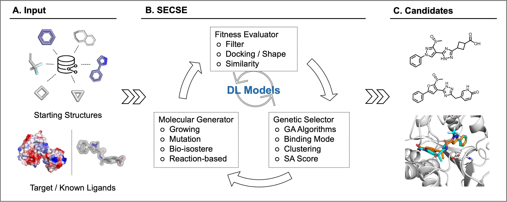

# **SECSE**

----------------------------

### SECSE: _**S**ystemic **E**volutionary **C**hemical **S**pace **E**xplorer_



Chemical space exploration is a major task of the hit-finding process during the pursuit of novel chemical entities.
Compared with other screening technologies, computational _de novo_ design has become a popular approach to overcome the
limitation of current chemical libraries. Here, we reported a _de novo_ design platform named systemic evolutionary
chemical space explorer (SECSE). The platform was conceptually inspired by fragment-based drug design, that miniaturized
a “lego-building” process within the pocket of a certain target. The key to virtual hits generation was then turned into
a computational search problem. To enhance search and optimization, human intelligence and deep learning were
integrated. SECSE has the potential in finding novel and diverse small molecules that are attractive starting points for
further validation.

### Tutorials and Usage

----------------------------
1. Setup dependencies
```bash
conda create --name secse -c rdkit -c conda-forge parallel tqdm biopandas openbabel chemprop xlrd=2 pandarallel rdkit=2022.03
conda activate secse
   ```
3. Set Environment Variables  
   `export SECSE=/path/to/SECSE`  
   if you use AutoDock Vina for docking:
   [(download here)](https://github.com/ccsb-scripps/AutoDock-Vina/releases)  
   `export VINA=/path/to/AutoDockVINA`  
   if AutoDock GPU: (adgpu-v1.5.3_linux_ocl_128wi)
   [(download here)](https://github.com/ccsb-scripps/AutoDock-GPU/releases)  
   `export AUTODOCK_GPU=/path/to/AutoDockGPU`  
   if you use [Gilde](https://www.schrodinger.com/products/glide) for docking (additional installation & license
   required):  
   `export SCHRODINGER=/path/to/SCHRODINGER`
4. Give execution permissions to the SECSE directory  
   `chmod -R +x /path/to/SECSE`
5. Input fragments: a tab separated _.smi_ file without header. See demo [here](demo/demo_1020.smi).
6. Parameters in config file:

   [DEFAULT]
    - _workdir_, working directory, create if not exists, otherwise overwrite, type=str
    - _fragments_, file path to seed fragments, smi format, type=str
    - _num_gen_, number of generations, type=int
    - _num_per_gen_, number of molecules generated each generation, type=int
    - _seed_per_gen_, number of selected seed molecules per generation, default=1000, type=int
    - _start_gen_, number of staring generation, default=0, type=int
    - _docking_program_, name of docking program, AutoDock-Vina (input vina) or AutoDock-GPU (input autodock-gpu) or
      Glide (input glide) , default=vina, type=str
    - _cpu_, number of max invoke CPUs, type=int
    - _gpu_, number of max invoke GPU for AutoDock GPU, type=int
    - _rule_db_, path to customized rule in json format, input 0 if use default rule, default=0

   [docking]
    - _target_, protein PDBQT if use AutoDock Vina; grid map files descriptor fld file if AutoDock GPU; Grid file if
      choose Glide, type=str
    - _RMSD_, docking pose RMSD cutoff between children and parent, default=2, type=float
    - _delta_score_, decreased docking score cutoff between children and parent, default=-1.0, type=float
    - _score_cutoff_, default=-9, type=float

   Parameters when docking by AutoDock Vina:
    - _x_, Docking box x, type=float
    - _y_, Docking box y, type=float
    - _z_, Docking box z, type=float
    - _box_size_x_, Docking box size x, default=20, type=float
    - _box_size_y_, Docking box size y, default=20, type=float
    - _box_size_z_, Docking box size z, default=20, type=float

   [deep learning]
    - _mode_, mode of deep learning modeling, 0: not use, 1: modeling per generation, 2: modeling overall after all the
      generation, default=0, type=int
    - _dl_per_gen_, top N predicted molecules for docking, default=100, type=int
    - _dl_score_cutoff_, default=-9, type=float

   [properties]
    - _MW_, molecular weights cutoff, default=450, type=int
    - _logP_lower_, minimum of logP, default=0.5, type=float
    - _logP_upper_, maximum of logP, default=7, type=float
    - _chiral_center_, maximum of chiral center,default=3, type=int
    - _heteroatom_ratio_, maximum of heteroatom ratio, default=0.35, type=float
    - _rotatable_bound_num_, maximum of rotatable bound, default=5, type=int
    - _rigid_body_num_, default=2, type=int

   Config file of a demo case [phgdh_demo_vina.ini](demo/phgdh_demo_vina.ini)  
   Customized rule json template [rules.json](demo/rules.json). Rule ID should be in the form G-001-XXXX, like
   G-001-0001, G-001-0002, G-001-0003 ...
7. Run SECSE  
   `python $SECSE/run_secse.py --config /path/to/config`  
    Please input the absolute path of the config file here.
8. Output files
    - merged_docked_best_timestamp_with_grow_path.csv: selected molecules and growing path
    - selected.sdf: 3D conformers of all selected molecules

### Dependencies

-------
GNU Parallel installation

- CentOS / RHEL  
  `sudo yum install parallel`
- Ubuntu / Debian  
  `sudo apt-get install parallel`
- From source: https://www.gnu.org/software/parallel/

numpy~=1.20.3, pandas~=1.3.3, xlrd～=2.0.1, pandarallel~=1.5.2, tqdm~=4.62.2, biopandas~=0.2.9, openbabel~=3.1.1, rdkit~=2021.03.5,
chemprop~=1.3.1, torch~=1.9.0+cu111

Linux server with CPUs only also works.

### Citation

-------
Lu, C.; Liu, S.; Shi, W.; Yu, J.; Zhou, Z.; Zhang, X.; Lu, X.; Cai, F.; Xia, N.; Wang, Y. Systemic Evolutionary Chemical
Space Exploration For Drug Discovery. J Cheminform 14, 19 (2022). 

https://doi.org/10.1186/s13321-022-00598-4


### License

-------
SECSE is released under [Apache License, Version 2.0](LICENSE.txt).

The project is being heavily developed, if you have any questions or suggestions, please contact: lu_chong@keenthera.com
